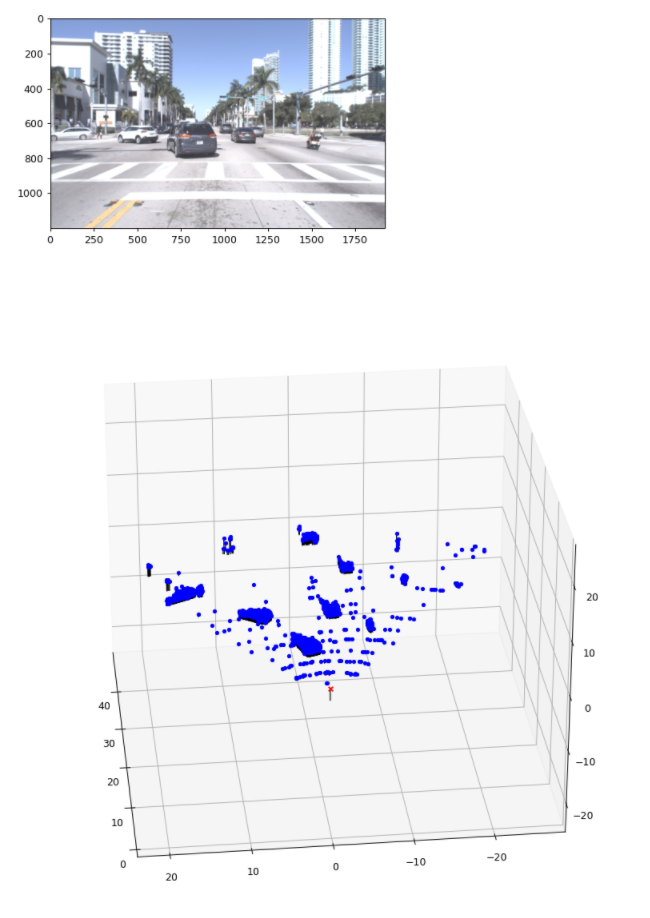

# [Project 5: Camera Calibration and Fundamental Matrix Estimation with RANSAC]

#### Please refer to proj5_code >> proj5.ipynb for details 

### Description
In this project, we are going to deal with camera and scene geometry. Specifically, we will estimate the
camera projection matrix, which maps 3D world coordinates to image coordinates, as well as the fundamental matrix, which relates points in one scene to epipolar lines in another. The camera projection matrix and fundamental matrix can each be estimated using point correspondences. To estimate the projection matrix (camera calibration), the input is corresponding 3D and 2D points. To estimate the fundamental matrix the input is corresponding 2D points across two images. You will start by estimating the projection matrix and the fundamental matrix for a scene with ground-truth correspondences. 

The next part of the project involves estimating the fundamental matrix using RANSAC and comparing the results of fundamental matrix estimation with and without RANSAC. The final portion of the project involves using the concepts learned to perform visual odometry and answer the corresponding reflection questions in the report.

